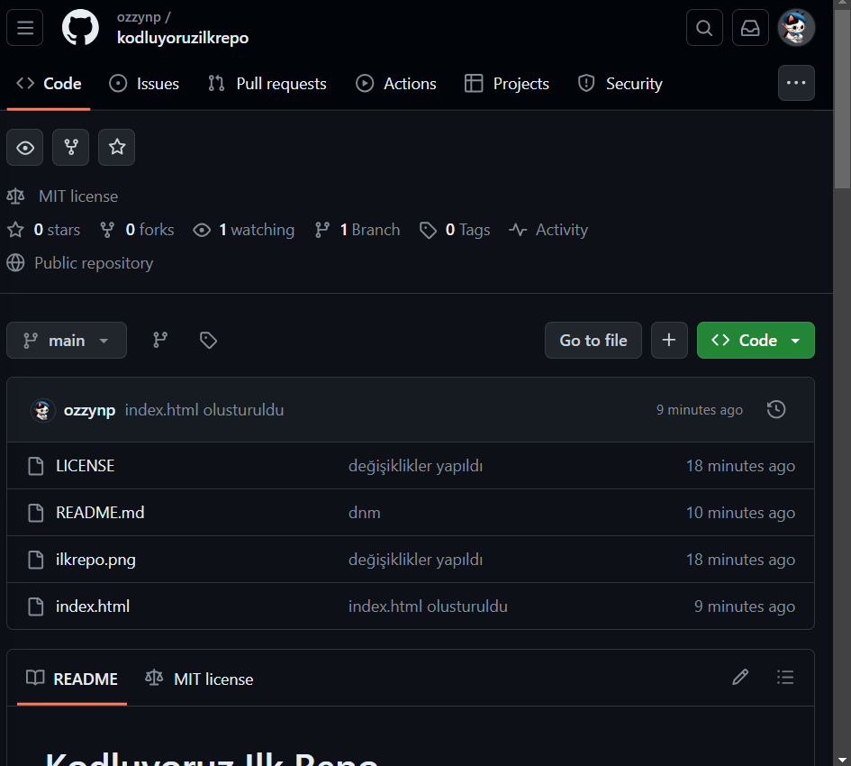

# Kodluyoruz Ilk Repo

Bu repo [Kodluyoruz](https://kodluyoruz.org/) Kodluyoruz Node.js Eğitimi kapsamında açtığım ilk repo. İçerisinde bir adet README.md dosyası, bir adet de index.html barındırıyor.



## Installation

Öncelikle projeyi clonelayın. (Buraya sizin reponuzdan aldığınız link gelecek)

` git clone https://github.com/ozzynp/kodluyoruzilkrepo1.git `

## Usage

Projeyi cloneladıktan sonra Visual Studio Code programında açınız.

```
cd kodluyoruzilkrepo1
code .
```

## Contributing 

Pull requestler kabul edilir. Büyük değişikler için, lütfen önce neyi değiştirmek istediğinizi tartışmak için bir konu açınız.

## Licence

[MIT](https://choosealicense.com/licenses/mit/)
